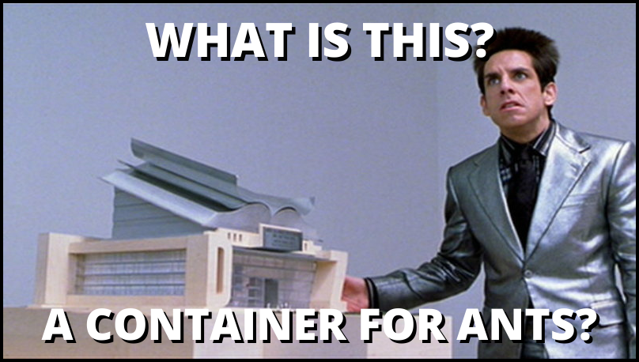

*I set out to build the smallest container image that I could that was still able to do something useful. By taking advantage of multistage builds, the `scratch` base image, and a tiny assembly based http server, I was able to get it down to 6.32kB!*



# Bloated Containers

*Containers are often touted as a silver bullet to solve every challenge associated with operating software. While I love containers, I often encounter container images in the wild that have a variety of issues. One common issue is size, with images sometimes clocking in at multiple GB!*

*Because of this, I decided to challenge myself and others to build the smallest possible image.*

## Challenge

*The rules are pretty simple:*

    * The container should serve the contents of a file over http on the port of your choosing
    * No volume mounts are allowed (Also known as “The Marek Rule” 😜)
    
## Naive Solution

To get a baseline image size, we can use node.js to create a simple server index.js:
```javascript
const http = require('http');
const { hostname } = require("os");
port="80";

const server = http.createServer((req, res) => {
  res.writeHead(200, { 'content-type': 'text/html' })
  fs.createReadStream('index.html').pipe(res)
})

server.listen(port, hostname, () => {
  console.log("Server: http://localhost:"+port+"/");
});
```
*and built it into an image starting the official node base image:*

```dockerfile
FROM node:14
COPY . .
CMD ["node", "index.js"]
```
# Getting Started

***These instructions will cover usage information and for the docker container*
### Prerequisities

*In order to run this container you'll need docker installed.***

    * [Windows](https://docs.docker.com/get-started/)
    * [OS X](https://docs.docker.com/get-started/)
    * [Linux](https://docs.docker.com/get-started/)
    
#### Build Docker Image
``docker build -t web-server .``

#### Run Docker Image
``docker run -it -p 80:80 web-server``

#### Open the Browser and hit `localhost:80`


   


    
